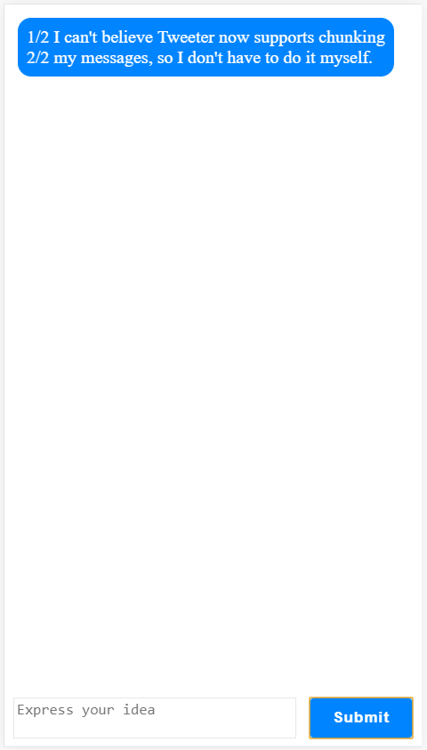
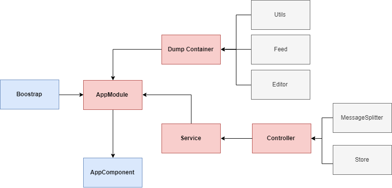

# TwitSplit




The product Tweeter allows users to post short messages limited to 50 characters each. 
 
Sometimes, users get excited and write messages longer than 50 characters. Instead of rejecting these messages, we would like to add a new feature that will split the message into parts and send multiple messages on the user's behalf, all of them meeting the 50 character requirement.

This project was generated with [Angular CLI](https://github.com/angular/angular-cli) version 7.2.2.


## Development server

Run `ng serve` for a dev server. Navigate to `http://localhost:4200/`. The app will automatically reload if you change any of the source files.

## Build

Run `ng build` to build the project. The build artifacts will be stored in the `dist/` directory. Use the `--prod` flag for a production build.

## Running unit tests

Run `ng test` to execute the unit tests via [Karma](https://karma-runner.github.io).


## Architecture



TwitSplit will bootstrap at `app.module.ts`. This module is where TwitSplit interact with other components of the application (Dump Container, Service, Controller).

* Dump Container: standalone component that only perform polisded DOM item which take data and output information.
* Service: this contains all method, and entities which are reusable. In TwitSplit, serivce will contains: Store (Data Service), MessageChunker (MessageSplitter) which is taken from controller.
* Controller: contains entity that handle application such as Data Store, MessageChunker. Keep in mind that some controller might not be service, it's only become service when it's reusable.

## Algorithm

MessageSplitter will automatically find the number of chunked messages from a content submited by user. Message will be splited based on 50 characters (max_length) and only be chunked by whitespace. 

For Example

```
I can't believe Tweeter now supports chunking my messages, so I don't have to do it myself.
```

Will return 

```javascript
["1/2 I can't believe Tweeter now supports chunking", "2/2 my messages, so I don't have to do it myself."]
```

*How it works*

```
Step 1: find batch size (number of chunked messages) by chunking message into 50 characters each (not detect whitespace)
    * Sum length of message plus message prefix.
        - add message length
        - add prefix length
    * Calculate batch size
Step 2: after getting batch size from step 1, recursively add learning batch size (increase step is add 1)
    * Initial bacth size is value from step 1.
    * Recursive:
        - Calculate prefix length (gap value) 
        - Return new batch size if (gap - previous gap) / batch <= 1
        - else increase batch size 1 and re-run the recursive.
```

## Further help

Lam Nguyen | lam.nguyen.mr@outlook.com